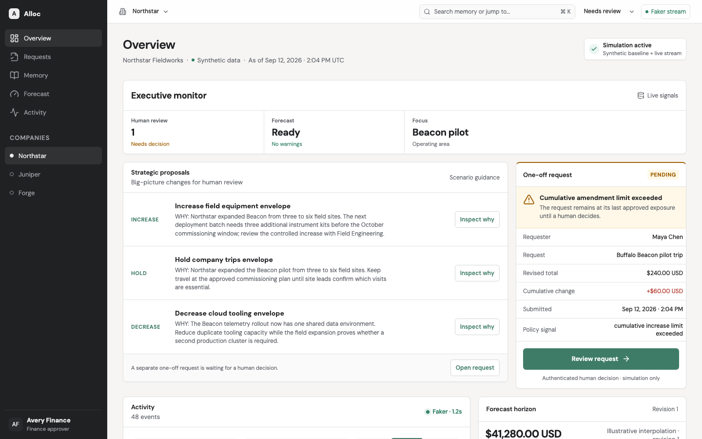
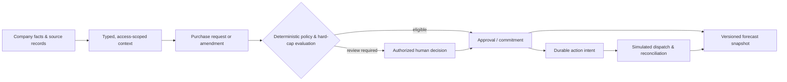

# Alloc

> Local financial intelligence for companies that need every spending decision to be explainable, governed, and grounded in current facts.

<p align="center">
  <a href="#quick-start">Quick start</a> ·
  <a href="#the-dashboard">Dashboard</a> ·
  <a href="#the-decision-pipeline">Decision pipeline</a> ·
  <a href="#security-and-financial-invariants">Safety model</a> ·
  <a href="#contributing">Contributing</a>
</p>

<p align="center">
  
</p>

<p align="center">
  <code>LOCAL-FIRST</code> · <code>EXACT MONEY</code> · <code>HUMAN AUTHORITY</code> · <code>AUDITABLE ACTIONS</code>
</p>

Alloc connects company-wide financial context to deterministic spending controls, auditable action intents, and forecasts. A sandboxed agent may investigate and propose, but it never receives authority to alter policy, bypass a cap, or execute a financial action on its own.

> [!NOTE]
> The dashboard above is the browser-verified Northstar **synthetic/mock** scenario. It demonstrates the current mock-client experience, not a live provider or complete live-backend dashboard.

> **Current state:** contracts, the local MongoDB/API foundation, synthetic company data, mock dashboard, transactional financial core, scheduler/executor, relationships, and forecast work are implemented to the extent recorded in [implementation progress](docs/architecture/11-implementation-progress.md). Local-model/GB10 validation, live connectors, and complete live dashboard wiring remain gated work—not completed features.

## Why Alloc

Financial systems are often rich in context but poor at answering a simple operational question: *can we safely do this now, and why?* Alloc makes that decision legible without treating model output, retrieved documents, or a UI state as authority.

| What it needs to do | How Alloc approaches it |
| --- | --- |
| Remember the whole company | Maintains typed financial and operational context across categories, vendors, locations, assets, software, labor, cash, liabilities, revenue, and taxes. Projects are optional—not the system boundary. |
| Decide precisely | Uses exact money, current record versions, authority, policies, cumulative amendments, and every binding hard cap at execution time. |
| Survive uncertainty | Persists idempotent commands, durable action intents, receipts, retries, and explicit reconciliation for ambiguous external outcomes. |
| Keep AI bounded | Gives a local OpenClaw agent narrow, typed tools and backend-issued execution context; model-supplied text cannot become permission or policy. |
| Make the future inspectable | Produces versioned forecast snapshots tied to source cutoffs and explains their inputs and revisions. |

## The dashboard

The browser dashboard makes a controlled financial decision readable in one frame: company context, scenario guidance, a request that has crossed a cumulative amendment rule, activity, and a forecast. It ships against contract-validated mock responses and covers all three synthetic companies; each live UI feature remains gated on its backend boundary.

## The decision pipeline

<p align="center">
  
</p>



The decision point is deliberately deterministic. An agent can retrieve bounded evidence and formulate a proposal, while the backend independently verifies identity, scope, current policy, versions, exact amounts, and budgets before it changes state.

## What is in the repository

| Area | Purpose | Evidence / boundary |
| --- | --- | --- |
| [`packages/contracts`](packages/contracts/README.md) | Versioned Zod/TypeScript/JSON Schema contracts, fixtures, operations, and narrow tool schemas. | Structural validation only; schemas never grant authority. |
| [`apps/api`](apps/api) | Fastify API, HS256 authentication, real-MongoDB persistence, financial mutations, context graph/evidence, forecasts, and execution runtime. | Financial mutation paths use a MongoDB replica set and transactions. |
| [`packages/financial-rules`](packages/financial-rules) | Pure policy evaluation, exact-money handling, amendments, and cumulative-limit rules. | No database or provider side effects. |
| [`packages/company-fixtures`](packages/company-fixtures/README.md) | Deterministic synthetic companies, source envelopes, and replayable finance data. | Northstar Fieldworks, Juniper Table, and Forge & Loom are explicitly synthetic. |
| [`packages/mock-api`](packages/mock-api/README.md) + [`apps/web`](apps/web) | Contract-validated mock data and responsive React dashboard. | Browser work is mock-backed until each live feature is wired. |
| [`packages/scheduler`](packages/scheduler/README.md) | P0/P1/P2 durable scheduling, leases, checkpoints, fencing, and bounded fairness. | Priority queues alone do not claim GPU preemption. |
| [`packages/agent-tools`](packages/agent-tools/README.md) | Scoped agent-tool gateway and adapter boundary. | Hosted smoke testing does not satisfy the local-only Qwen/GB10 gate. |
| [`experiments/finance-poc`](experiments/finance-poc/README.md) | Standalone MongoDB experiment that informed the production contracts. | Independently runnable; not the application test suite. |

## Quick start

### Prerequisites

- Node.js 20+ for the workspace (the pinned agent runtime uses Node 24.16.0; see [`.nvmrc`](.nvmrc))
- Docker Desktop for real MongoDB integration, E2E, and local development
- npm

From the repository root:

```sh
npm ci
npm run verify
```

`npm run verify` runs the schema check, build, typecheck, unit tests, real-replica-set integration tests, and real-process HTTP E2E tests. Integration and E2E suites create and remove only their own loopback-only MongoDB containers; they do not connect to an existing MongoDB instance.

### Run the local API

```sh
npm run dev
```

This command starts a workspace-owned single-member MongoDB replica set, builds the workspace, seeds the synthetic company scaffolding, and prints a development token. In Conductor it uses the allocated `CONDUCTOR_PORT`; otherwise it falls back to `PORT` or `3000`. The local database is for development only, not a high-availability topology.

For a built deployment process, provide the required environment:

```sh
export MONGO_URI='mongodb://127.0.0.1:27017/?replicaSet=alloc'
export MONGO_DATABASE='alloc'
export JWT_SECRET='replace-with-a-secret-at-least-32-bytes-long'
npm start
```

The API refuses a standalone MongoDB deployment, requires a 32-byte-or-longer HS256 secret, derives tenant identity from verified token claims, and redacts sensitive configuration in errors.

## Commands

| Command | What it verifies or runs |
| --- | --- |
| `npm test` | Build plus workspace unit tests. |
| `npm run test:integration` | Real MongoDB replica-set checks in owned Docker containers. |
| `npm run test:e2e` | Real API process against a real replica set. |
| `npm run verify` | Full local verification gate. |
| `npm run dev` | Workspace-scoped MongoDB and API, plus a development token. |
| `npm start` | Built API; requires `MONGO_URI`, `MONGO_DATABASE`, and `JWT_SECRET`. |
| `npm run executor` | Durable simulated-action executor. |
| `npm run agent -- "<prompt>"` | One isolated OpenClaw turn through the configured model. |
| `npm run test:agent:e2e` | Temporary hosted DeepSeek/OpenClaw smoke; requires `DEEPSEEK_API_KEY` and is not the local-model gate. |

The standalone POC remains separately reproducible:

```sh
cd experiments/finance-poc
npm ci --ignore-scripts --no-audit --no-fund
npm test
```

## Security and financial invariants

Alloc is intentionally strict about where authority lives.

- Store and evaluate exact money and currency—never model-generated arithmetic or stale narrative summaries.
- Atomically update applicable caps, commitments, decisions, audit records, and action intents in a transaction.
- Check the revised full amount, cumulative amendments, active authority, policy epoch, expected versions, and every applicable cap at execution time.
- Treat source documents, GitHub text, retrieved evidence, and model output as untrusted inputs. They cannot modify policy or permissions.
- Use idempotency keys, source deduplication, version checks, and reconciliation. An uncertain provider outcome remains unresolved until evidence settles it.
- Preserve company-wide totals when a record is visible through overlapping category, location, or vendor views.
- Keep financial-provider and unrestricted database credentials out of model tools.

These principles are described in detail in [governance and execution](docs/architecture/04-governance-and-execution.md), [data consistency](docs/architecture/03-data-and-consistency.md), and the [contract package](packages/contracts/README.md).

## Demo companies

Alloc ships with three coherent, deterministic, **synthetic** profiles that share one financial schema:

| Company | Domain | Intended story |
| --- | --- | --- |
| Northstar Fieldworks | Industrial software | Software development activity, purchase requests, and financial exposure. |
| Juniper Table | Restaurants | Food, facilities, labor, vendor, and operating context. |
| Forge & Loom | Manufacturing | Equipment, facilities, inventory-adjacent, and production context. |

Fixture sources and imported data are always labeled as synthetic/imported/live. Seed details, replay, and reconciliation checks live in [`packages/company-fixtures`](packages/company-fixtures/README.md).

## Agent and runtime boundary

OpenClaw is the selected agent framework. Alloc begins with one shared model server and one active generation globally; specialist work is bounded, scoped, and has no financial execution authority.

The current development path includes a temporary `deepseek/deepseek-v4-flash` configuration. Set `ALLOC_AGENT_MODEL` only after configuring that provider within the isolated, gitignored `.context/openclaw` state. The committed architecture still requires an evidence-backed local Qwen3.8 27B deployment on the target GB10, a pinned checkpoint/serving format, measured memory overhead, and no hosted fallback before the local-agent release gate can close.

## Architecture and delivery

Start with the architecture index, then use the live GitHub issue map to claim a lettered work item. The implementation is designed for parallel work without inventing competing contracts.

1. Read the [architecture index](docs/architecture/README.md), [parallel workstreams](docs/architecture/12-parallel-workstreams.md), and [delivery gates](docs/architecture/08-delivery-and-validation.md).
2. Find the assigned lettered task in the [issue map](docs/architecture/13-issue-map.md); inspect ownership, dependencies, and linked PRs before editing.
3. Separate a task’s *start prerequisites* from its *live integration gate*. Contract fixtures can enable independent work; a mocked pass never closes a real backend/model/hardware gate.
4. Ship focused tests, integration evidence, and a task-level E2E flow with the work.

The progression and remaining gates are maintained in [implementation progress](docs/architecture/11-implementation-progress.md). Use it as the factual status source rather than inferring completion from a dashboard or a green partial suite.

## Contributing

Please follow [AGENTS.md](AGENTS.md). In particular:

- Claim the assigned GitHub issue before implementation and record your workspace/branch and scope.
- Use a separate workspace/branch for independently owned work and coordinate shared root or contract files.
- Preserve unrelated changes; never broadly reset a worktree or clean shared Docker data.
- Include the task ID in the PR title, link it accurately, and record actual verification commands and remaining gates before resolving an issue.
- Update implementation progress and the tracking issue when a milestone genuinely changes state.

## Further reading

- [System boundaries and deployment shape](docs/architecture/01-system-overview.md)
- [Company-wide financial memory](docs/architecture/10-company-wide-memory.md)
- [Priority scheduling and agent lifecycle](docs/architecture/05-scheduling-and-runtime.md)
- [Forecasting and learning](docs/architecture/07-forecasting-and-learning.md)
- [GB10 capacity and bounded subagents](docs/architecture/09-hardware-and-subagents.md)
- [Full architecture index](docs/architecture/README.md)

---

Alloc is built to make the safe path the easy path: useful operational intelligence, with the authority to act held by deterministic, auditable systems.
