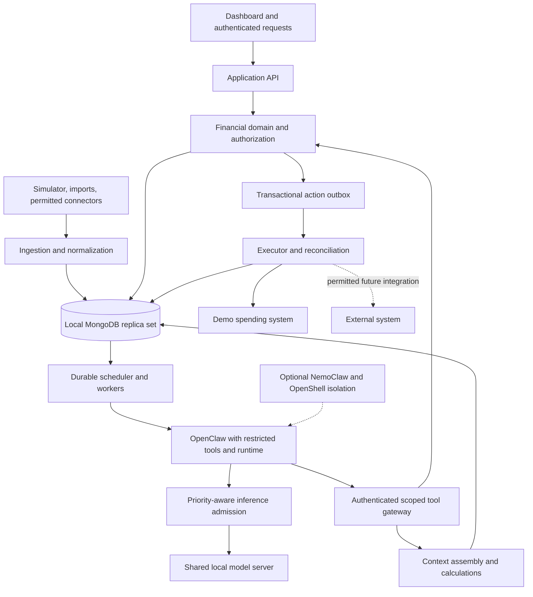

# System boundaries

## Deployment shape

Use a modular backend with explicit ownership boundaries. Separate API and worker processes prevent slow model requests from blocking request admission or financial transactions. They share domain modules and MongoDB, without introducing independent microservices for every responsibility.

All required demo components run on the GB10. A laptop can display the web interface over the local network. Hosted inference and automatic cloud fallback are disabled. Local services are exposed only as needed for the demo.

## Responsibilities

| Boundary | Owns | Does not own |
| --- | --- | --- |
| Ingestion | Source validation, deduplication, mapping, source progress | Financial authorization |
| Context service | Entity resolution, scoped queries, evidence packets, summaries | Authority to spend |
| Financial core | Money arithmetic, policy evaluation, commitments, state transitions | Interpretation of arbitrary prose as authority |
| Worker and scheduler | Durable work, leases, priority, retries, checkpoints | Inventing permissions or business urgency |
| Agent | Investigation, evidence selection, explanations, proposed scenarios | Database credentials, policy editing, unrestricted execution |
| Executor | Validated action delivery, receipts, reconciliation | Reinterpreting model recommendations |
| Dashboard | Requests, approval UI, provenance, status, forecasts | Bypassing the application service |

OpenClaw is the selected framework under the user's at-least-one requirement. Run it with explicit tool allowlists, no host shell or financial credentials, and restricted filesystem/network access. NemoClaw and OpenShell are optional infrastructure isolation choices: NemoClaw manages the agent environment and OpenShell enforces its sandbox controls. Alloc's backend enforces business rules in every topology. Network permission to reach an API does not imply permission to approve a purchase through that API.

## End-to-end example

An employee asks to increase an existing travel request by $30. The API authenticates the employee, resolves the actual request, and persists a revision command. Trusted application code determines whether the request qualifies for automatic approval using its revised total, cumulative exception allowance, policy version, and current budget.

If the policy permits it entirely from verified fields, the application commits the approval and reservation without waiting for the model. The agent may explain that completed decision afterward. If the case needs interpretation, a high-priority investigation retrieves the trip, project context, and source evidence. Its recommendation returns to the same deterministic financial gate.

The committed decision schedules forecast work. The forecast incorporates the outstanding commitment; a later matched transaction replaces that commitment with actual spend. A project status change can inform the explanation but cannot retroactively authorize an expense.

## Shared context versus shared conversations

Persistent company knowledge lives in application records, not a single growing chat. Each job gets a bounded, authorized context packet. Agent conversation history can help resume a job, but is never authoritative for balances or permissions. Multiple investigations can reuse the same factual records without sharing private user sessions.

## Degraded operation

- Model unavailable: deterministic eligible requests continue; interpretive cases remain pending or go to a human.
- MongoDB unavailable: financial mutations stop. Cached screens are labeled stale; no approval is inferred from cached balances.
- Connector stale: missing activity is displayed as a coverage gap. It is not treated as zero spend.
- Search unavailable: scoped exact and lexical retrieval continue with reduced capability clearly reported.
- Executor outcome unknown: retain the pending financial exposure and reconcile before retrying or releasing it.

## Source

[NVIDIA's architecture documentation](https://docs.nvidia.com/nemoclaw/user-guide/openclaw/about/how-it-works) describes the relationship between NemoClaw, OpenShell, inference routing, and the selected agent runtime. The domain boundaries above are Alloc design decisions.
