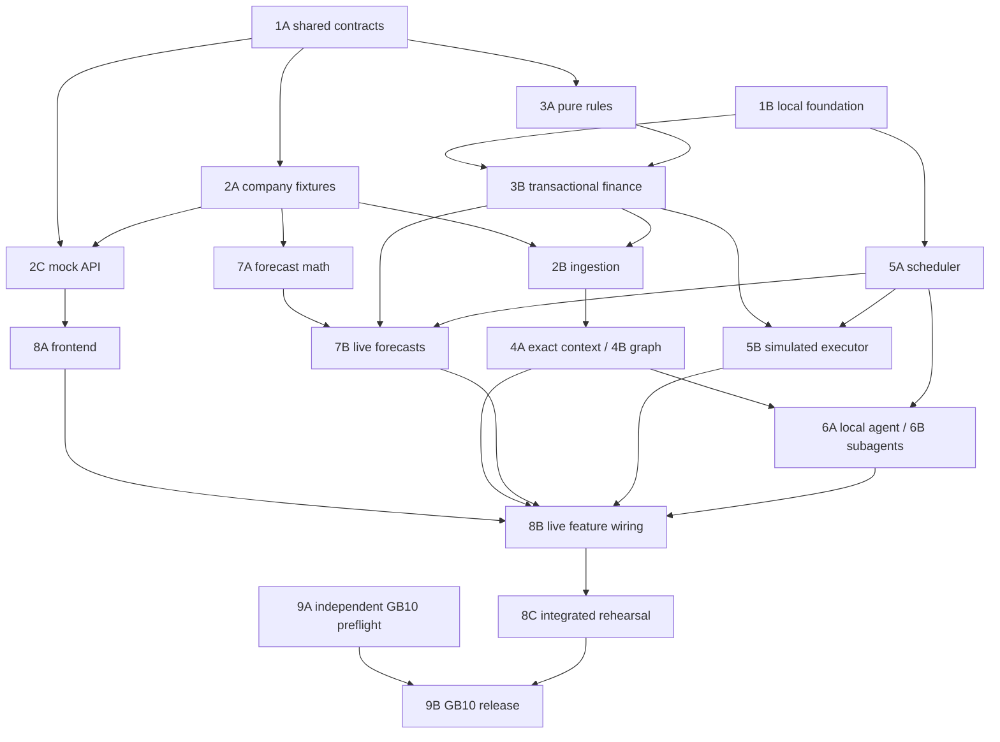

# Parallel workstreams and dependencies

Product/design decisions are settled; 1A translates them into shared executable contracts rather than reopening them. Collaborators should claim their assigned tasks through the [issue map](13-issue-map.md) and follow [contributor instructions](../../AGENTS.md). This document describes dependencies; it does not assign a task automatically.

## How to read the task IDs

Numbers identify the architectural stage; letters identify independently assignable tasks inside it. They are not a single execution order. For example, 8A frontend work can begin while 3B financial persistence is being built.

“Start after” means the inputs needed to implement the task are available. “Live gate requires” identifies providers that must pass their own relevant gates before this task can claim end-to-end integration. Work against contract fixtures is allowed earlier, but is labeled mocked and cannot close a live integration gate.

Every task owns focused verification, integration checks, and a task-level E2E flow. Test authoring begins with the task; it is not a separate final testing phase.

## Task map

| ID | Deliverable | Start after | Live gate requires | Verification, integration, and E2E exit evidence |
| --- | --- | --- | --- | --- |
| **1A** | Shared data/API/event/tool contracts: IDs, money, scope, request states, errors, versions, provenance, priority | Existing architecture; can be prepared first | No runtime prerequisite | Validate schemas and examples; producer/consumer contract checks; trace the full request/amend/review/posting example through specified messages |
| **1B** | Local TypeScript runtime, MongoDB replica set, configuration, authentication, health, isolated test harness | Can start independently; consume 1A before API completion | 1A | Typecheck/config validation; real DB commit/abort and authentication tests; actual HTTP startup/restart smoke flow |
| **2A** | Three fictional company manifests, finance/source fixtures, deterministic scenario clock | 1A | None beyond 1A | Validate IDs and cross-record references; reconcile fixture totals and commitments; replay each company's scenario deterministically in the fixture harness |
| **2B** | JSON/CSV ingestion, source delivery/revision handling, entity mapping, authoritative financial ingestion | 1A + 1B; use 2A fixture format | 2A + 3B for financial effects | Invalid/duplicate/stale row cases; real DB deduplication and rollback; HTTP import→retrieval→updated exposure→safe replay |
| **2C** | Frontend mock API and response fixtures | 1A; use 2A as it becomes available | No live backend required | Mock responses validate against 1A; client contract checks; mock-client flows cover success, pending review, denial, stale state, and API errors; full browser coverage belongs to 8A |
| **3A** | Pure financial policy evaluation and money/cumulative-limit rules | 1A | None beyond 1A | Exhaustive meaningful rule fixtures; combine full request state, policy and trusted authority; deterministic request→amendment→review decision flow |
| **3B** | Transactional financial core: caps, commitments, request revisions, approvals, postings, audit, action intents | 1A + 1B + 3A; test with small owned fixtures | 3A; consume 2A for company acceptance | Real concurrent/rollback/idempotency tests; authenticated HTTP $180→+$30→review sequence; verify cap and commitment-to-spend invariants |
| **4A** | Company-wide exact retrieval and authorized context packets | 1A + 1B; owned fixtures allow work before ingestion | 2B + 3B for current financial context | Tenant/category/scope and index checks; compare packet balances to current DB versions; retrieve food/software/site context without projects through HTTP |
| **4B** | Verified relationships, bounded graph traversal, summary freshness and access-safe caches | 1A + 1B; 4A interfaces | 2B + 4A | Traversal bounds and restricted endpoints; evidence-edit/access-change invalidation; graph→summary→source drill-down with no cross-tenant leakage |
| **5A** | Durable scheduler: P0/P1/P2 admission, leases, retries, checkpoints, coalescing | 1A + 1B; synthetic handlers suffice | No financial/model prerequisite for scheduler tests | Priority/fairness tests; real DB multi-worker fencing and recovery; interrupt a fixture job and resume while admitting higher-priority work |
| **5B** | Simulated action executor and receipt reconciliation | 1A + 1B; consume 3B action contract | 3B + 5A | Duplicate/unknown outcome rules; crash-after-side-effect and receipt persistence tests; approve→dispatch→restart→single reconciled simulated action |
| **6A** | OpenClaw/local-Qwen adapter, scoped tools, inference admission | 1A; local runtime/model availability; contract tool server can be used first | 3B + 4A + 5A + actual local model | Hostile/malformed tool proposals; real model→tool authorization and local-only routing; agent investigates evidence and cannot bypass caps |
| **6B** | Bounded project/spending subagents and result merging | 1A + 6A interfaces | 4A + 5A + 6A | Child scope/output validation; global inference budget and stale child handling; urgent request during two child investigations with traceable results |
| **7A** | Pure forecast/scenario calculations and snapshot schema | 1A + 2A | None beyond those inputs | Exact numeric cases, recurring-obligation overlap, late data and currency boundaries; fixture financial history→baseline→scenario with independently computed expected totals |
| **7B** | Scheduled forecast refresh, snapshot persistence, source cutoffs, contribution deltas | 1A + 1B + 7A; synthetic event trigger initially | 2B + 3B + 5A + 7A | Coalescing and cutoff integration tests; approval/posting/correction updates snapshots without duplication; HTTP retrieval of linked current/prior forecasts |
| **8A** | Frontend shell and screens: company views, requests/reviews, memory, forecast, activity | 1A; 2C enables interactive work and 2A supplies scenarios | 2C for mocked-browser gate only | Component/accessibility tests; mock client-contract integration; browser E2E for all three companies and error/pending states |
| **8B** | Live frontend wiring by feature | 8A; each feature connects when its backend is gated | Requests: 3B; imports: 2B; memory: 4A/4B; activity: 5A/5B; forecasts: 7B; agent UI: 6A/6B | Replace mocks feature by feature; run corresponding browser→HTTP→MongoDB/worker flow and its failure cases immediately |
| **8C** | Integrated demo rehearsal and accumulated regression suite | Completed relevant 8B features | 2A–2B, 3A–3B, 4A–4B, 5A–5B, 6A–6B, 7A–7B, 8A–8B for full planned scope | All three companies, cold startup, offline operation, injection attempts, stale sources, restarts and urgent work; retain scenario seeds/traces |
| **9A** | GB10 model/runtime preflight and capacity probe | Hardware access; independent of UI and most backend work | Exact model artifact and local serving runtime | Verify weight/runtime/DB memory budget, local tool-call support, no cloud fallback; load/restart model and run a bounded real tool task |
| **9B** | GB10 integrated release gate | 9A + 8C | Entire integrated demo on the target machine | Repeat cumulative suite on GB10; offline cold boot; peak memory and latency under concurrent urgent/background activity |

2B's ingestion transport/mapping can be developed while 3B is in progress, using its financial-write contract. Its financial E2E gate waits for 3B. Conversely, 3B uses its own typed test fixtures and does not wait for the importer, avoiding a circular dependency.

## Practical parallel assignments

After 1A, the work can be assigned to four lanes. Claim the corresponding issues before starting; these lanes describe ownership boundaries rather than automatically assigning work.

| Lane | Primary tasks | What it can do while other lanes are unfinished |
| --- | --- | --- |
| Frontend | 2C → 8A → incremental 8B | Build/test every screen against versioned response fixtures; no database or model required |
| Data and memory | 2A → 2B; 4A → 4B | Build company scenarios, mappings, retrieval fixtures and query tests; connect live financial reads when 3B is gated |
| Financial backend | 1B; 3A → 3B; 5B integration | Complete caps, revisions, authorization, posting and concurrency tests using minimal owned fixtures |
| Runtime and analysis | 5A; 7A → 7B; 6A → 6B; 9A when hardware exists | Test scheduling with bounded fake handlers, calculate forecasts from fixtures, and probe the model without waiting for the dashboard |

The runtime/analysis lane contains independently assignable tasks; with more people, 7A forecasting and 9A hardware can run separately. Parallelism is limited by shared-file ownership, integration readiness, and actual compute capacity rather than the numbering.

## Dependency sketch

Arrows show major live-integration dependencies, not all opportunities to begin isolated implementation. The task table is authoritative for start prerequisites.

## Prevent integration surprises

- Give 1A shared schemas/contracts a single owner. Consumers reference them; they do not invent separate amount units, status names, or tenant conventions.
- Mocks and fixtures must validate against those same contracts. They never become a second financial rules engine.
- Each lane owns its implementation and tests. Agree ownership of root package/build configuration to avoid conflicting setup changes.
- Freeze representative request, review, posting, memory, forecast and error examples early. Explicitly version breaking changes and rerun affected producer/consumer tests.
- Integrate completed features continuously. Do not wait for the entire backend before wiring the first frontend flow.
- A mocked browser pass and a real HTTP/database pass are separately reported. The final demo gate requires the latter plus real model/target-hardware checks where applicable.
